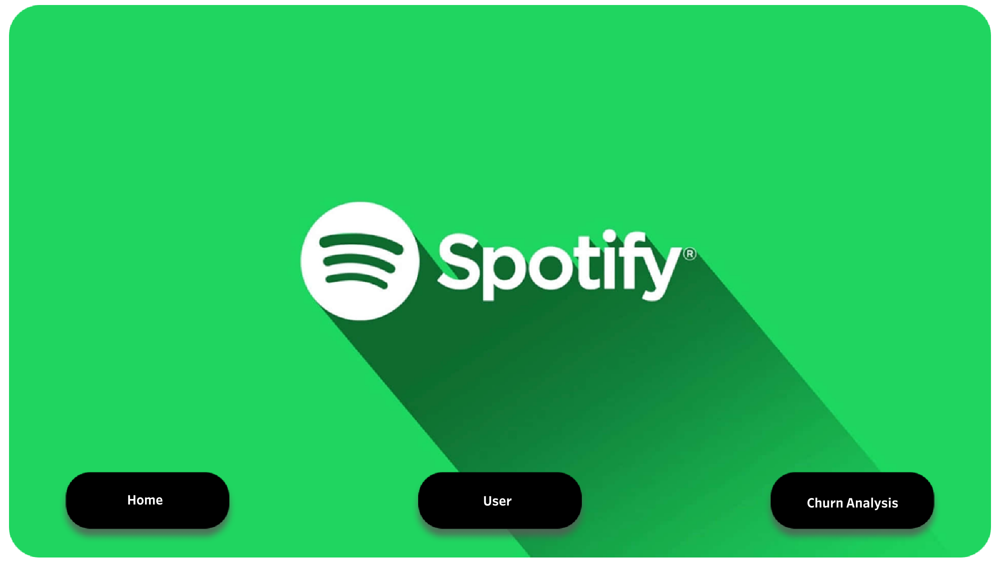
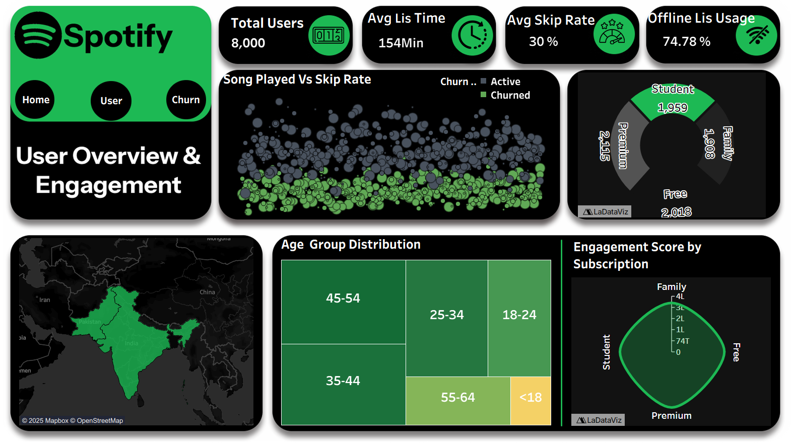

# 🎧 Spotify Churn Analysis Dashboard  

 
## 📌 Project Overview  
This project focuses on **user churn analysis for Spotify** using **Tableau** for visualization and **Figma** for design refinement.  
The goal is to answer three key questions:  
- **Who churns?**  
- **Why do they churn?**  
- **How does user behavior impact retention?**  

---

## 📊 Dashboard Design  

### **Page 1 – User Overview**
**KPIs:**  
- Total Users  
- Active Users  
- Churned Users  
- Listening Time  
- Skip Rate  

**Demographics:**  
- Age  
- Gender  
- Subscription Type  

**Visuals:**  
- 📦 **Treemap:** Listening Time (Watch Hours)  
- 🍩 **Donut Chart:** Subscription Split  
- 📈 **Scatter Plot:** Songs Played vs Skip Rate  

---

### **Page 2 – Churn Analysis & Risk Factors**
**KPIs:**  
- Churn by Subscription  
- Age Group  
- Gender  
- Device  
- Engagement  

**Visuals:**  
- 📊 **Bar Chart:** Churn by Subscription & Age Group  
- 📉 **Boxplot:** Listening Time vs Churn  
- 📡 **Radar Chart:** Device Type Churn  
- 🗺 **Map:** Churn by Country  
- 🔄 **Scatter Plot:** Engagement Score vs Churn  

---

 

## 💡 Key Insights  
- **Churn Rate:** **25.9%** (2,071 out of 8,000 users)  
- **Free & Family plans** have the highest churn rate  
- **25–34 year-old users** churn the most  
- Churned users show:  
  - Lower listening time  
  - Higher skip rates  
  - Fewer offline downloads  
- **Engagement is the strongest predictor** of retention  

---

## 🛠️ Tools & Tech  
- **Tableau:** Dashboard building & storytelling  
- **Figma:** Custom UI/UX design  
- **Excel / CSV:** Data preprocessing  
- **GitHub:** Version control & documentation  

---

## 🚀 How to Use  
1. **Clone the repository**  
2. Open the dataset: `spotify_churn_dataset.csv`  
3. Open the Tableau workbook: `Spotify_Churn_Dashboard.twbx`  
4. Explore the **2-page dashboard**  

---

## 📢 Connect with Me  

  
  
  
  

---

## 🔑 Takeaway  
**High engagement = low churn.**  
This project demonstrates how combining **data + storytelling + polished design** can uncover **actionable business insights**.  

---
